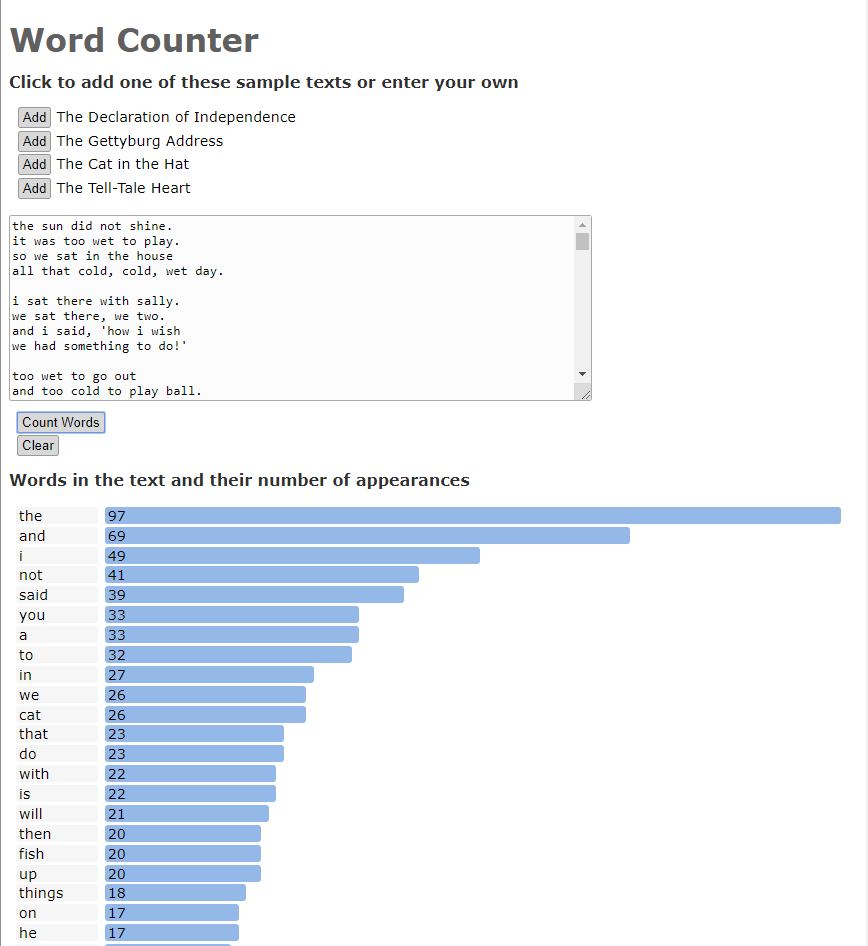

# Word Counter

#### By **Phil Mass**

## Description

_This was created as a test of using the reduce function to count word frequencies. It includes some sample texts that you can add with a click or you can paste in any other text._

_You can see the deployed version [here](https://philrmass.github.io/word-count/)._

## Setup And Installation

* Clone the project from https://github.com/philrmass/word-count.git to a local directory
* Open index.html in a browser

## Known Bugs

_None_

## Support and Contact Details

If you have any issues or questions, please email me at philrmass@gmail.com

## Technologies Used

This project was created with JavaScript and CSS

## Legal

Copyright (c) 2018 Phil Mass

Licensed under the MIT License
